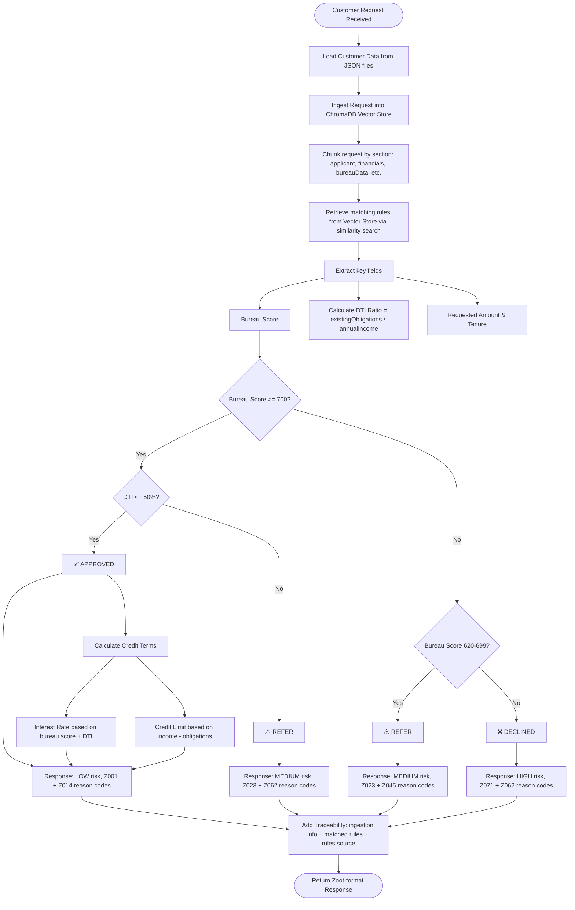
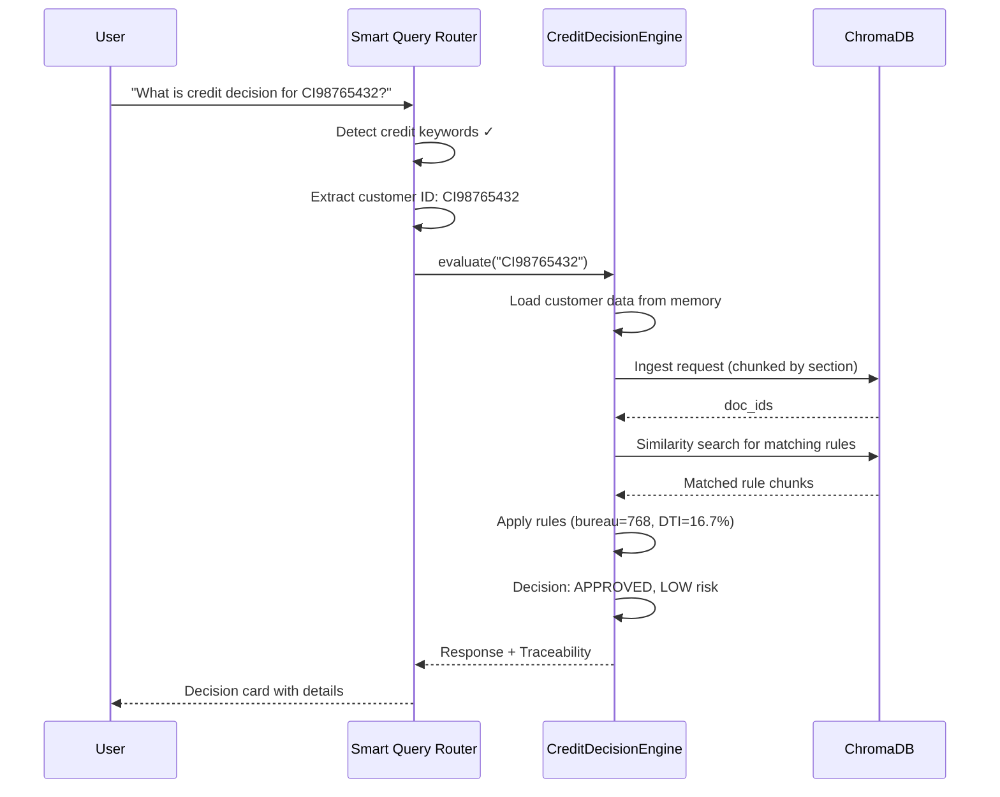

# Credit Decision Engine — Zoot Rules Flow

## Overview

The Credit Decision Engine (`decision_engine.py`) applies **Zoot business rules** to customer credit applications. It integrates with the Vector Store for rule retrieval and request storage, producing decisions in the standard Zoot response format.

---

## Decision Flow Diagram



---

## Business Rules (from ZootRules.xlsx)

| Rule | Bureau Score | DTI Check | Decision Code | Risk Band | Risk Score Range |
|------|-------------|-----------|---------------|-----------|-----------------|
| 1    | >= 700      | <= 50%    | **APPROVED**  | LOW       | 200 - 380       |
| 2    | 620 - 699   | Any       | **REFER**     | MEDIUM    | 500 - 655       |
| 3    | < 620       | Any       | **DECLINED**  | HIGH      | 750 - 1450      |

### DTI (Debt-to-Income) Calculation

```
DTI = existingObligations / annualIncome
Threshold = 0.50 (50%)
```

If DTI exceeds 50%, even a high bureau score customer gets **REFER** instead of **APPROVED**.

---

## Reason Codes

| Code | Description | Used In |
|------|-------------|---------|
| Z001 | Strong bureau score | APPROVED |
| Z014 | Income sufficient for requested amount | APPROVED |
| Z023 | Thin credit file | REFER |
| Z045 | Recent delinquency observed | REFER (when DTI is OK) |
| Z062 | High debt-to-income ratio | REFER / DECLINED |
| Z071 | Low bureau score | DECLINED |

---

## Credit Terms Calculation (APPROVED only)

### Interest Rate
- Based on bureau score tier and DTI ratio
- Lower bureau score → higher rate
- Higher DTI → rate penalty applied

### Credit Limit
- Based on `annualIncome - existingObligations`
- Capped relative to requested amount
- Higher income surplus → higher limit

---

## Sample Test Scenarios

### Scenario 1: APPROVED
```json
{
  "customerId": "CI98765432",
  "name": "Anita Kumar",
  "bureauScore": 768,
  "annualIncome": 900000,
  "existingObligations": 150000,
  "requestedAmount": 300000,
  "DTI": "16.7% (within threshold)"
}
```
**Result:** APPROVED, Risk Score ~312, Risk Band LOW

### Scenario 2: DECLINED
```json
{
  "customerId": "CI98765444",
  "name": "Test Zoot",
  "bureauScore": 76,
  "annualIncome": 900000,
  "existingObligations": 150000,
  "DTI": "16.7% (within threshold)"
}
```
**Result:** DECLINED, Risk Score ~845, Risk Band HIGH (bureau score far below 620)

### Scenario 3: REFER
```json
{
  "customerId": "CI98765555",
  "name": "Test Zoot",
  "bureauScore": 630,
  "annualIncome": 900000,
  "existingObligations": 150000,
  "DTI": "16.7% (within threshold)"
}
```
**Result:** REFER, Risk Score ~625, Risk Band MEDIUM (bureau score in 620-699 range)

---

## Vector Store Integration



---

## Response Format (Zoot Standard)

```json
{
  "header": {
    "requestId": "REQ-2025-0042",
    "responseTimestamp": "2026-04-05T10:30:00Z"
  },
  "decision": {
    "decisionCode": "APPROVED",
    "decisionDescription": "Approved",
    "creditLimit": 500000,
    "interestRate": 11.5,
    "tenureMonths": 24
  },
  "risk": {
    "riskScore": 312,
    "riskBand": "LOW"
  },
  "reasonCodes": [
    { "code": "Z001", "description": "Strong bureau score" },
    { "code": "Z014", "description": "Income sufficient for requested amount" }
  ]
}
```

---

## API Endpoints

| Method | Endpoint | Description |
|--------|----------|-------------|
| POST   | `/query` | Smart query — auto-routes credit questions to decision engine |
| POST   | `/api/decision/evaluate/<customer_id>` | Evaluate a specific customer |
| POST   | `/api/decision/evaluate-request` | Evaluate an ad-hoc request payload |
| GET    | `/api/decision/customers` | List available customer IDs |
| POST   | `/api/decision/reload` | Reload customer data from disk |

---

## Entry Points

1. **Web UI** — Type a credit decision question in the query box (e.g., "credit decision for CI98765432")
2. **REST API** — Call `/api/decision/evaluate/CI98765432` directly
3. **Test Script** — Run `python ingest_zoot.py` to test all 3 scenarios (APPROVED, DECLINED, REFER)
