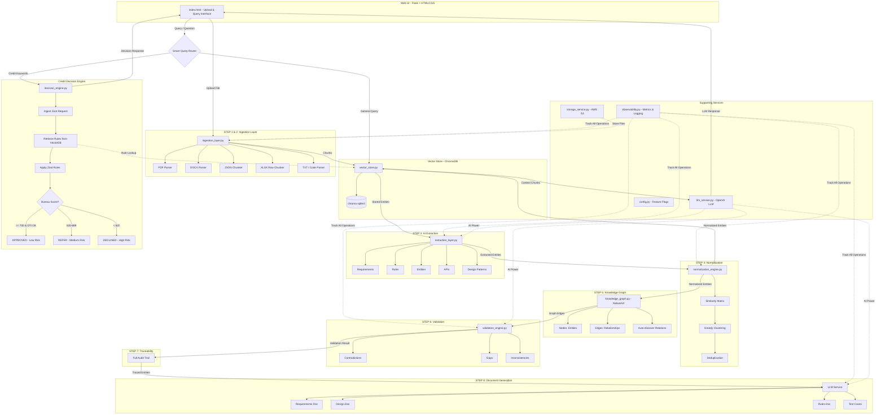
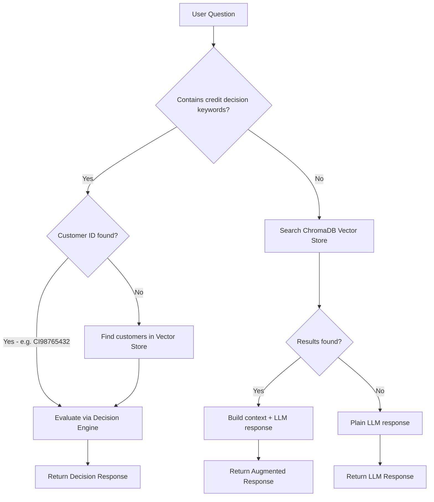

# ArtifactGenerator — Enterprise Knowledge Platform

## Overview

A **RAG-based (Retrieval-Augmented Generation) Enterprise Knowledge Platform** built with Flask. It ingests documents from multiple sources, extracts knowledge using AI, builds a knowledge graph, and generates artifacts — with a specialized **Zoot Credit Decision Engine** as a key use case.

---

## Architecture Diagram

---

## 8-Step Pipeline Flow

### STEP 1 & 2 — Ingestion (`ingestion_layer.py`)

- User uploads files (PDF, DOCX, JSON, XLSX, TXT) via the web UI (`/upload`) or the `/api/ingest/sample-data` endpoint.
- Each file is parsed by **format-specific handlers** and split into **text chunks** with configurable chunk size and overlap.
- Chunks are stored in **ChromaDB** vector store (`vector_store.py`) and optionally uploaded to **AWS S3** (`storage_service.py`).

**Supported formats:**
| Format | Handler | Chunking Strategy |
|--------|---------|-------------------|
| PDF    | PyPDF   | Recursive text splitting |
| DOCX   | python-docx | Recursive text splitting |
| JSON   | Built-in | Section-based chunking |
| XLSX   | openpyxl | Row-based chunking |
| TXT    | Built-in | Recursive text splitting |
| Code   | Built-in | File-level chunks |

**API Endpoints:**
- `POST /upload` — Upload and ingest a single file
- `POST /api/ingest/sample-data` — Ingest Zoot sample data files from `data/` directory

---

### STEP 3 — AI Extraction (`extraction_layer.py`)

- Uses the **OpenAI LLM** (via LangChain) to extract structured entities from the ingested text chunks.
- Identifies 5 entity types: **Requirements, Rules, Entities, APIs, Design Patterns**.
- Each extracted entity receives a **confidence score** and full **traceability metadata** (source document, extraction method, timestamp).
- The LLM is configured with **low temperature** for deterministic extraction.

**API Endpoint:** `POST /api/extract`

---

### STEP 4 — Normalization (`normalization_engine.py`)

- Builds a **semantic similarity matrix** using sentence-transformer embeddings (or simple string similarity as fallback).
- Applies **greedy clustering** with a configurable threshold (default: **0.85**) to group near-duplicate entities.
- Merges similar entities into **canonical forms**, tracking all merged sources and synonyms.
- Normalized entities are stored back into ChromaDB with full traceability.

**API Endpoint:** `POST /api/normalize`

---

### STEP 5 — Knowledge Graph (`knowledge_graph.py`)

- Adds normalized entities as **nodes** in a **NetworkX directed graph**.
- **Auto-discovers relationships** between entities using text analysis and optional LLM assistance.
- Relationship types: `requires`, `implements`, `conflicts_with`, `documents`, `version_of`, `part_of`, `aggregates`.
- Detects **cycles**, **orphaned nodes**, and **connected components**.
- Exportable to JSON for external visualization tools.

**API Endpoints:**
- `POST /api/knowledge-graph/build` — Build the graph from normalized entities
- `GET /api/knowledge-graph` — Get graph statistics
- `GET /api/knowledge-graph/export` — Export full graph as JSON
- `GET /api/knowledge-graph/subgraph/<entity_id>` — Get subgraph around a specific entity

---

### STEP 6 — Validation (`validation_engine.py`)

- Detects **contradictions** between entities using LLM-assisted semantic analysis.
- Identifies **gaps** in information coverage.
- Finds **inconsistencies** and version mismatches across entities.
- Validates **knowledge graph relationships** for structural correctness.
- Produces a **validation score** (0-100) and a detailed report with all issues.

**API Endpoint:** `POST /api/validate`

---

### STEP 7 — Traceability

- Every entity in the system carries a **full audit trail**: `Source Document → Extracted Entity → Normalized Entity → Knowledge Graph Node`.
- Metadata preserved at every step: **confidence scores**, **extraction methods**, **source file info**, **timestamps**, and **version**.
- Enables full backward tracing from any generated artifact to its original source.

---

### STEP 8 — Document Generation (`llm_service.py`)

- Uses the **OpenAI LLM** (with higher temperature for creative generation) to produce structured documents from extracted entities.
- Generated document types:
  - **Requirements Document** — from requirement-type entities
  - **Design Document** — from design, entity, API, and database entities
  - **Business Rules Document** — from rule-type entities
  - **Test Cases** — from all entity types
- All generated documents are flagged with `requires_review: true`.

**API Endpoints:**
- `POST /api/generate/requirements`
- `POST /api/generate/design`
- `POST /api/generate/rules`

---

### Full Pipeline Execution

- `POST /api/pipeline/run` — Runs all steps sequentially: Extract → Normalize → Knowledge Graph → Validate → Traceability Summary.
- Requires a document to be ingested first via `/upload` or `/api/ingest/sample-data`.

---

## Smart Query Router (`/query`)

The query endpoint intelligently routes user questions:

**Credit decision keywords:** `credit decision`, `credit score`, `bureau score`, `approved`, `declined`, `refer`, `zoot`, `risk score`, `dti`, `loan approval`, etc.

---

## Key Files Reference

| File | Purpose |
|------|---------|
| `app/main.py` | Flask app, all REST routes, pipeline orchestration |
| `app/config.py` | Feature flags, thresholds, environment variables |
| `app/ingestion_layer.py` | Multi-format document parsing & text chunking |
| `app/extraction_layer.py` | LLM-powered structured entity extraction |
| `app/normalization_engine.py` | Semantic deduplication & clustering |
| `app/knowledge_graph.py` | NetworkX directed graph with auto-discovered relationships |
| `app/validation_engine.py` | Conflict, gap, and inconsistency detection |
| `app/decision_engine.py` | Zoot credit decision rules engine |
| `app/models/schemas.py` | Pydantic data models for all entities and results |
| `app/models/vector_store.py` | ChromaDB wrapper with traceability support |
| `app/services/llm_service.py` | OpenAI LLM chains for extraction & generation |
| `app/services/storage_service.py` | AWS S3 file upload and retrieval |
| `app/observability.py` | Prometheus metrics, event logging, feedback loop |
| `app/templates/index.html` | Web UI for upload, query, and decision display |
| `app/static/style.css` | UI styling with decision color coding |
| `ingest_zoot.py` | Test script for full decision engine flow |

---

## Technology Stack

| Component | Technology |
|-----------|------------|
| Backend   | Python, Flask |
| LLM       | OpenAI (via LangChain) |
| Vector DB | ChromaDB |
| Embeddings| Sentence-Transformers |
| Graph     | NetworkX |
| Storage   | AWS S3 (boto3) |
| Data Models| Pydantic |
| Metrics   | Prometheus |
| Frontend  | HTML, CSS, JavaScript |
